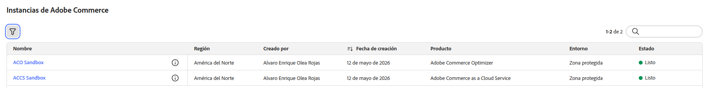
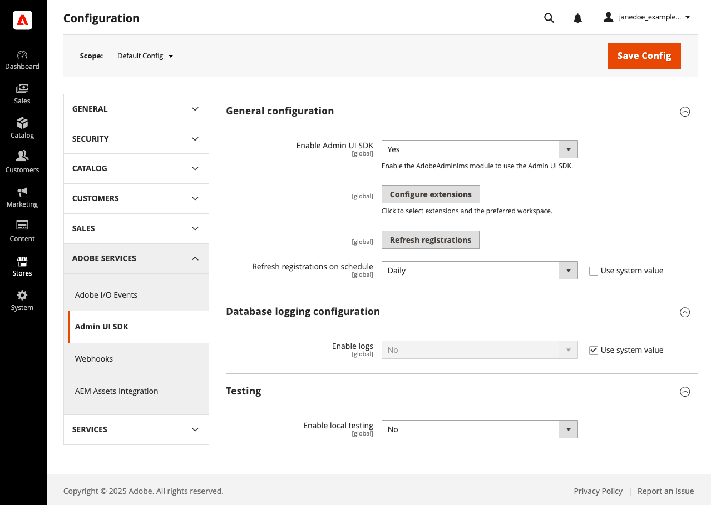
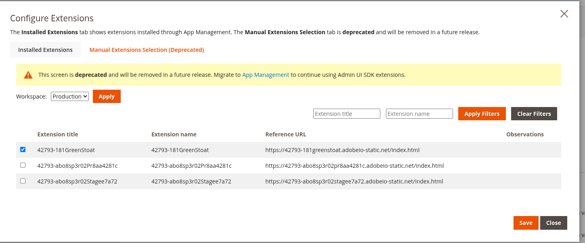
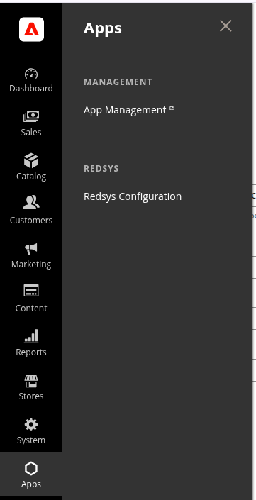
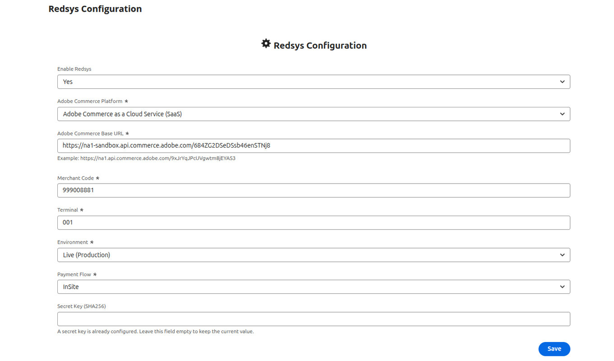

# Installing the Redsys App for Adobe Commerce

## Overview

This guide explains how to install and configure the Redsys App for Adobe Commerce.

The application provides a secure payment integration between Adobe Commerce and the Redsys payment platform using Adobe App Builder Runtime. It supports both Redirect and InSite payment flows while keeping merchant credentials securely on the server side.

## Features

- Redsys Redirect payments
- Redsys InSite embedded payments
- Secure server-side signature generation
- Webhook processing
- Multi-store support
- Adobe Commerce as a Cloud Service integration
- Adobe App Builder Runtime architecture

## Supported platforms

The Redsys app currently supports Adobe Commerce as a Cloud Service (SaaS).

## Before you begin

### Set up Adobe Commerce as a Cloud Service

Before you begin, you will first need to have an instance of Adobe Commerce as a Cloud Service running. You can create one by:

1. Navigating to [Experience Cloud Console](https://experience.adobe.com/)
1. Under **Quick Access**, click **Commerce**
1. At the top right hand side of the page, click **Add instance**

   

If you are testing the app on a sandbox / development environment, you can import [available sample data](https://github.com/slamech/commerce-sample-data) from Adobe to your Commerce instance.

### Set up App Builder

#### Obtain a license

You will need a [license for App Builder](https://developer.adobe.com/app-builder/docs/get_started/app_builder_get_started/set-up#access-and-credentials) in order to deploy the app. App Builder is necessary so that you can configure IMS authentication credentials, configure Commerce I/O Events, persist data to Adobe I/O Lib Files, or generate encryption keys for your environment file.

#### Create the project

Once you have an App Builder license, navigate to [Adobe Developer Console](https://developer.adobe.com/console/). You should see there a **Create project from template**
button, indicating that your App Builder license is active:


Click on the **Create project from template** button, and select App Builder as a template:


Fill the project details and click save:


#### Add necessary APIs to the project

1. Select an environment, such as **Stage** or **Production**, click the **Add service** button, and then select **API**.

   

1. Select **Adobe I/O Events for Adobe Commerce** and add it to the environment.

   

1. Repeat the same steps, and add the **I/O Management API** to the environment.

   

1. Repeat the same steps, and add the **Adobe Commerce as a Cloud Service** to the environment.

   

#### Set up your local environment

Before you can deploy the app to App Builder, you will additionally need to install **Node.js** and the **Adobe I/O CLI** package.
Please follow [the official instructions](https://developer.adobe.com/app-builder/docs/get_started/app_builder_get_started/set-up#local-environment-setup) to set up your local environment.

## Install the App via Adobe Exchange Marketplace

To install the Redsys app, follow the steps below:

1. Navigate to the app's listing on the [Adobe Exchange Marketplace](https://exchange.adobe.com/apps/browse/ec?appType=ABD&listingType=applications&page=1&partnerLevel=All&product=COMMC&q=Redsys&sort=RELEVANCE)
1. Click on the app listing to view it.
1. At the top right hand side, click the **Free** button and follow the instructions to install the app into your organization's environment.
1. The app will appear under [Adobe Exchange App Management](https://exchange.adobe.com/manage). If you are an account admin, click the **Review** button on the app page in order to approve it.
1. At the app's page, you will see a **Download Code** button at the top bar. Click it to download the app's code locally. You will need the code to set up your OAuth Credentials.
   
1. Extract the downloaded code to a local directory, and use the CLI to run the following commands:

   ```sh
   # Navigate to the extracted project directory
   cd path/to/extracted/Redsys-app

   # Login and configure Adobe CLI (run from the project root directory)
   aio login -f
   aio console org select
   aio console project select
   aio console workspace select
   aio app use --merge
   ```

1. Confirm that the `.env` and `.aio` files were added to the project directory, and run the following command:

   ```bash
   # Run from the Redsys app project root directory
   npm run sync-oauth-credentials
   ```

   This will generate entries in the `.env` file:

   ```env
   OAUTH_CLIENT_ID=
   OAUTH_CLIENT_SECRETS=[""]
   OAUTH_TECHNICAL_ACCOUNT_ID=
   OAUTH_TECHNICAL_ACCOUNT_EMAIL=
   OAUTH_SCOPES=[""]
   OAUTH_IMS_ORG_ID=
   ```

   The above values will be read by the deployed app's runtime actions, in order to create access tokens for the Adobe Commerce Admin API.

1. Generate and add encryption keys for sensitive credentials by running the following command:

   ```sh
   # Run from the Redsys app project root directory
   npm run generate-encryption-key
   ```

   The command will output two environment variables which you need to add to your `.env` file:

   ```env
   ENCRYPTION_KEY=
   ENCRYPTION_IV=
   ```

1. Install app dependencies:

   ```sh
   # Run from the Redsys app project root directory
   npm install
   ```

1. Deploy the updated app:

   ```sh
   # Run from the Redsys app project root directory
   aio app deploy
   ```

## Redsys Configuration

Before you can access the Redsys configuration page, you will need to register the Redsys app in your Adobe Commerce admin area. You can do that by following the steps below:

1. Log into your Adobe Commerce admin area.
1. Navigate to **Stores** > Settings > **Configuration > Adobe Services > Admin UI SDK**

   

1. Enable the **Admin UI SDK** and set the **Refresh registrations on schedule** to daily.
1. Click **Configure extensions**.

   

1. Select the Redsys app and click **Save**.
1. A Redsys menu will appear on the sidebar. Click **Redsys Configuration**.

   

1. The main configuration screen will appear.

   

The following settings are available for configuration

- **Enable**: Will enable or disable the payment method at your storefront.
- **Adobe Commerce Rest endpoint**: This is the REST API endpoint of your Adobe Commerce as a Cloud Service instance. You can get this by navigating to your [Commerce instances](https://experience.adobe.com/#/commerce/cloud-service/instances), and clicking the information icon (i) next to to the Commerce instance you want to connect to. A modal will appear listing the **REST endpoint**.
- **Merchant Code**: Redsys merchant identifier.
- **Terminal**: Redsys terminal number.
- **Environment**: Redsys Environment (Sandbox or Production).
- **Secret Key**: Shared secret used to generate and validate payment signatures.
- **Payment Flow**: Select Redirect or InSite.

## Webhook Configuration

The application exposes a secure webhook endpoint that receives asynchronous notifications from Redsys.

The endpoint validates the payment signature before updating the Adobe Commerce order status.

## Security

The application keeps all merchant credentials inside Adobe App Builder Runtime.

Sensitive values such as merchant keys are never exposed to the storefront.

## Troubleshooting

If payments cannot be created:

- Verify the Merchant Code.
- Verify the Secret Key.
- Verify the Adobe Commerce REST endpoint.
- Verify that the Runtime application has been deployed.

## Add Redsys to your EDS storefront

You can add the Redsys payment method at the checkout page of your EDS storefront by utilizing a pre-built EDS block,
which includes all functionality needed to render the payment form, collect the payment and place the order.

You can find this EDS block at [https://github.com/seidor-cx/redsys-eds-payment-block](https://github.com/seidor-cx/redsys-eds-payment-block). Instructions on how to integrate it with your EDS storefront can be found inside the [README.md](https://github.com/seidor-cx/redsys-eds-payment-block/README.md) file at the same location.
